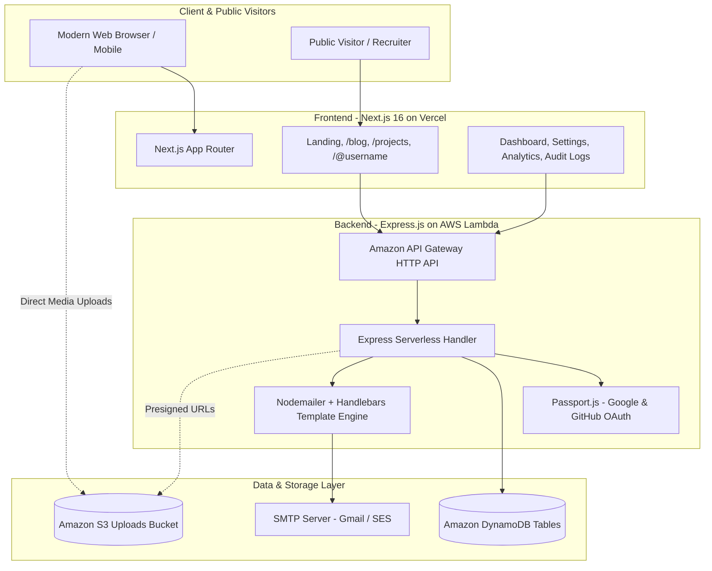

# Document 1: Application Purpose & Real-World Use Cases

**Application Name:** Fullstack Auth & Developer Portfolio Platform  
**Target Audience:** Software Engineers, Tech Creators, SaaS Developers, Technical Teams  
**Architecture:** Serverless Fullstack (Next.js 16 App Router + Express.js AWS Lambda + Amazon DynamoDB + Amazon S3)  

---

## 1. Executive Summary & Vision

The **Fullstack Auth & Developer Portfolio Platform** is a unified, enterprise-ready web application designed to solve one of modern software engineering's most common friction points: **fragmented developer presence and boilerplates**.

Currently, a developer or creator must maintain separate tools for:
1. **Authentication & User Management** (Auth0, Clerk, or custom complex setups).
2. **Developer Portfolio & Link-in-Bio** (Linktree, Bento, personal portfolio sites).
3. **Technical Publishing & Blogging** (Medium, Dev.to, Hashnode, Substack).
4. **Project Showcases & Case Studies** (GitHub readme pages, personal showcase sites).
5. **Auditing & Analytics** (Google Analytics, Mixpanel, log aggregators).

This platform merges all five domains into a single **self-hosted or serverless-native solution**. It delivers bank-grade authentication, multi-factor security, rich markdown publishing, an interactive project portfolio, and live analytics—all running on an ultra-scalable, low-cost AWS serverless backbone.

---

## 2. Core Problems Solved

| Problem in Market | How This Application Solves It |
|---|---|
| **High Cost & Vendor Lock-in for Auth** | Proprietary auth vendors (Clerk, Auth0) charge escalating fees per active user. This platform provides a 100% owned, custom-built authentication system using JWT, bcrypt, and DynamoDB. |
| **Scattered Digital Identity** | Developers have projects on GitHub, links on Twitter/X, blogs on Medium, and resumes on LinkedIn. The platform provides a vanity URL (`/@username`) acting as a central command hub. |
| **Complex MFA & Security Implementation** | Many startups struggle to implement standard-compliant TOTP 2FA, session revocation, and security audit logs. This application provides them out-of-the-box. |
| **Heavy Cloud Infrastructure Maintenance** | Traditional containerized or VM setups require server patching and continuous costs. This application leverages AWS Lambda, DynamoDB, and Amazon S3 with pay-per-request pricing and zero maintenance. |
| **Privacy Concerns with Analytics** | Instead of bloated third-party trackers that get blocked by adblockers, this platform incorporates an internal, privacy-first view and click analytics tracking engine. |

---

## 3. Primary Real-World Use Cases & User Personas

### Use Case A: The Developer & Creator Portfolio Hub
* **Persona:** Full-stack engineer, freelancer, open-source contributor, or technical consultant.
* **Workflow:**
  1. The user registers an account and claims their vanity username (e.g. `/@krishna`).
  2. In the **Dashboard Settings**, they customize their avatar, bio, location, social links (GitHub, Twitter, LinkedIn), and custom external links.
  3. Under **Projects**, they create rich project showcases highlighting technologies, live demos, GitHub repositories, screenshots, and system architecture.
  4. Under **Blogs**, they publish technical articles with rich markdown formatting and category tags.
  5. Visitors visit `https://platform.domain/@username` to explore projects, read articles, and click out to external links.
  6. The user monitors profile impressions, link CTR, and geographic visitors directly in their **Analytics Dashboard**.

### Use Case B: Turnkey Production-Ready SaaS Authentication Starter
* **Persona:** SaaS Founder, Indie Hacker, or Enterprise Tech Lead bootstrapping a new product.
* **Workflow:**
  1. Clones this repository as the foundation for their next software product.
  2. Immediately inherits battle-tested auth capabilities:
     - Email verification via 6-digit codes.
     - Password reset flows with automated email delivery.
     - One-click Google & GitHub OAuth 2.0 social sign-ins.
     - TOTP Two-Factor Authentication (Google Authenticator / Authy).
     - Concurrent multi-device session revocation.
     - Tamper-resistant security audit logs.
  3. Extends the existing Express routes and DynamoDB models to add domain-specific SaaS logic.

### Use Case C: Technical Content Marketing & Engineering Blogs
* **Persona:** Developer Advocates, DevRel professionals, and Technical Writers.
* **Workflow:**
  1. Authors draft articles directly within the platform's blog editor with live preview.
  2. Articles are published to the public `/blog` feed and assigned categories and tags.
  3. Search engine optimized (SEO) dynamic metadata, canonical tags, and OpenGraph tags ensure high discoverability on Google and social media.

### Use Case D: Enterprise Security & Compliance Demonstration
* **Persona:** Security-conscious teams requiring strict access controls and visibility.
* **Workflow:**
  1. Users configure 2FA enforcement for sensitive administrative operations.
  2. Every authentication event (successful logins, failed attempts, password modifications, 2FA activations) is logged with timestamp, remote IP, and geolocated city/country.
  3. If a user detects unauthorized activity, they can click **Revoke Other Sessions** to instantly invalidate all other active tokens across all devices.

---

## 4. Key Stakeholders & Roles

```
┌─────────────────────────────────────────────────────────────┐
│                       STAKEHOLDERS                          │
└─────────────────────────────────────────────────────────────┘
          │                              │
          ▼                              ▼
┌───────────────────┐          ┌───────────────────┐
│   Public Guest    │          │ Authenticated User│
│    (Anonymous)    │          │  (Creator / Dev)  │
├───────────────────┤          ├───────────────────┤
│ • Browse Landing  │          │ • Manage Profile  │
│ • View Articles   │          │ • Author Articles │
│ • Explore Projects│          │ • Create Projects │
│ • Visit /@user    │          │ • Setup 2FA / MFA │
│ • Click Links     │          │ • Review Analytics│
│ • Sign Up / In    │          │ • Revoke Sessions │
└───────────────────┘          └───────────────────┘
```

---

## 5. Architectural High-Level System Flow



---

## 6. Business & Technical Benefits

1. **Near-Zero Idle Cost:** With AWS Lambda, API Gateway, DynamoDB On-Demand, and S3 pay-per-request billing, the platform costs fractions of a cent when idle.
2. **Infinite Elasticity:** Automatically scales from 1 to 100,000+ concurrent requests without needing Kubernetes clusters or autoscaling groups.
3. **Enhanced Trust & Security:** Transparent security alerts sent via email when logins occur, alongside visible audit logs, build high confidence for users.
4. **Complete Ownership:** No vendor lock-in; database models, authentication logic, and frontend components remain 100% under your control.
