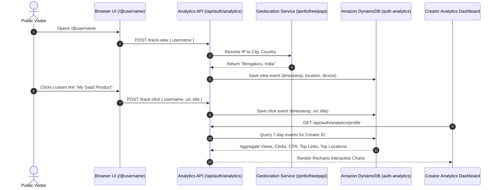

# Document 2: Features & Integrations Guide

**Application Name:** Fullstack Auth & Developer Portfolio Platform  
**Target Environment:** Node.js, Express.js, Next.js 16, AWS Cloud Infrastructure  
**Document Scope:** Comprehensive breakdown of all functional features, technical modules, third-party services, and cloud integrations.

---

## 1. Feature Matrix Overview

```
┌──────────────────────────────────────────────────────────────────────────────────────────┐
│                                APPLICATION FEATURE MATRIX                                │
├──────────────────────────┬─────────────────────────────┬─────────────────────────────────┤
│ Module                   │ Key Capabilities            │ Underlying Technologies         │
├──────────────────────────┼─────────────────────────────┼─────────────────────────────────┤
│ Authentication & Access  │ Email/Password, Social Auth,│ JWT, bcrypt, Passport.js,       │
│                          │ TOTP 2FA, Sessions, Rate Lmt│ Speakeasy, DynamoDB Sessions    │
├──────────────────────────┼─────────────────────────────┼─────────────────────────────────┤
│ Public Portfolio Hub     │ Vanity /@user, Link-in-Bio, │ Next.js Dynamic Routes, GSAP,   │
│                          │ Themes, Showcase Tabs       │ Motion, Tailwind CSS v4         │
├──────────────────────────┼─────────────────────────────┼─────────────────────────────────┤
│ Project Showcase Engine  │ Portfolio CMS, Tech badges, │ AWS DynamoDB, Markdown parser,  │
│                          │ Demos, Media, SEO Metadata  │ S3 Presigned Uploads            │
├──────────────────────────┼─────────────────────────────┼─────────────────────────────────┤
│ Blogging & CMS Platform  │ Article Authoring, Tags,    │ React Markdown, Rehype Raw,     │
│                          │ Slugs, Instant Search, Paging│ Remark GFM, DynamoDB GSI       │
├──────────────────────────┼─────────────────────────────┼─────────────────────────────────┤
│ Real-Time Analytics      │ Profile Views, Link Clicks, │ Custom Analytics Engine,        │
│                          │ Geolocation, CTR Charts     │ Recharts, IP Geolocation API    │
├──────────────────────────┼─────────────────────────────┼─────────────────────────────────┤
│ Security & Audit Logs    │ Tamper-evident activity log,│ DynamoDB Audit Logs,            │
│                          │ IP geocoding, Multi-session │ User-Agent parser, Sessions API │
├──────────────────────────┼─────────────────────────────┼─────────────────────────────────┤
│ Email Delivery Engine    │ Verification, Welcome, Reset│ Nodemailer, Handlebars (.hbs),  │
│                          │ Login Security Alerts       │ AWS SES / SMTP                  │
├──────────────────────────┼─────────────────────────────┼─────────────────────────────────┤
│ Cloud & Serverless Infra │ Serverless compute, S3 direct│ AWS SAM, AWS Lambda, API Gateway│
│                          │ upload, Auto-scaling NoSQL  │ DynamoDB, S3 Presigner, Vercel  │
└──────────────────────────┴─────────────────────────────┴─────────────────────────────────┘
```

---

## 2. Authentication & Security Subsystem

### 2.1 Credential-Based Authentication
* **Password Hashing:** Uses `bcrypt` with a cost factor of 10 to ensure cryptographically secure, irreversible password storage.
* **Email Verification (6-Digit OTP):** 
  - Generates a cryptographically randomized 6-digit numeric token upon registration.
  - Verification tokens expire strictly after 15 minutes.
  - Accounts remain flagged `isVerified: false` and cannot log in until confirmed.
  - Public `/resend-verification-public` endpoint with rate limiting to prevent user enumeration.
* **Password Recovery Flow:**
  - Secure `/forgot-password` endpoint delivers a 1-hour expiration 6-digit token to the user's email.
  - Password updates invalidate the token immediately.

### 2.2 Social OAuth 2.0 Integration
Integrated via `Passport.js` strategies with support for dynamic linking and redirect handling:
* **Google OAuth 2.0:** Implemented via `passport-google-oauth20` requesting `profile` and `email` scopes.
* **GitHub OAuth 2.0:** Implemented via `passport-github2` requesting `user:email` scope.
* **Account Linking & Disconnection:**
  - Authenticated users can link their Google or GitHub account from **Settings > Security**.
  - Users can safely disconnect a social provider as long as a password or alternative login remains active.
* **OAuth State Passing:** Passes authentication tokens via query state to allow authenticated linking flows from within the dashboard.

### 2.3 Two-Factor Authentication (TOTP / MFA)
* **Algorithm:** Time-Based One-Time Password (TOTP) conforming to RFC 6238 via `speakeasy`.
* **Setup Flow:**
  1. Backend generates a 32-character base32 secret and otpauth URL.
  2. Frontend renders a high-resolution QR code using `qrcode`.
  3. The user scans the QR code using Google Authenticator, Authy, or 1Password.
  4. User enters a test code; once verified, `mfaEnabled` is set to `true`.
* **MFA Login Challenge Intercept:**
  - If a user with MFA logs in (via password or OAuth), the server issues a short-lived ephemeral token (valid for 5 minutes).
  - The client is redirected to `/login/mfa`, where the code is validated via `/verify-mfa-login` before the real session token is generated.

### 2.4 Multi-Device Session Management
* **Device & IP Fingerprinting:** Every login captures the client's `User-Agent` string, IP address, and creation timestamp.
* **Session Termination:**
  - Users can view all active logged-in devices in **Settings > Sessions**.
  - Single-session revocation (`DELETE /api/auth/sessions/:id`).
  - Remote session kill switch (`DELETE /api/auth/sessions/others` - logs out all other devices while preserving the current active device).

### 2.5 Security Audit Logging & Alerts
* **Event Capture:** Automatically records security events (e.g., `Account created`, `Successful login`, `Successful MFA login`, `Password changed`, `MFA enabled`).
* **IP Geolocation Resolution:** Translates IP addresses to geographic locations (City, Region, Country) using `ipinfo.io` or `freeipapi.com`.
* **Proactive Security Alert Emails:** Users with `emailNotifications` enabled receive an immediate HTML alert when a new login occurs, detailing timestamp, IP, device, and city/country.
* **Rate Limiting:** Protects `/signup`, `/login`, `/forgot-password`, and `/resend-verification-public` against brute force using custom sliding window rate-limiting middleware (default: 10 requests per minute).

---

## 3. Public Creator & Portfolio Platform (`/@username`)

### 3.1 Personalized Vanity URL Routing
* Next.js 16 dynamic route `src/app/[username]/page.tsx` strictly enforces the `@` prefix convention (e.g. `/@krishna`).
* Reserved route protection prevents collision with critical system paths (`/dashboard`, `/login`, `/api`, `/blog`).
* Provides custom SEO metadata generation (`generateMetadata`) reflecting the user's name and bio.

### 3.2 Dynamic Profile & Bio Features
* **Custom Bio & Meta:** Display name, bio description, location, website link, and joined date.
* **Social Link Badges:** Integrated shortcuts to GitHub, Twitter/X, and LinkedIn.
* **Custom Link-in-Bio List:** Configurable list of custom outbound links with custom labels.
* **Dynamic Theme Customization:** Accent color injection and theme mode synchronization (custom CSS variables).
* **Privacy Toggle:** Users can switch their public profile between `Public` and `Private` mode with instant 403 enforcement.

### 3.3 Interactive Profile Tabs
* **Overview Tab:** Summary of developer profile, highlighted stats, and top projects.
* **Projects Tab:** Filterable list of published portfolio projects with live demo links.
* **Articles Tab:** Published technical articles written by the creator.

---

## 4. Project Showcase & Portfolio Management

### 4.1 Comprehensive Project Metadata Model
The project management module (`/dashboard/projects` and `/projects/[slug]`) supports an exhaustive set of enterprise project attributes:
* **Core Info:** Title, Slug, Excerpt, Rich Markdown Content, Categories, and Tags.
* **Visual Media:** Featured cover image, Logo, Thumbnail, Video Demo URL, and Screenshot Gallery.
* **Specifications:** Project Type, Difficulty Level, Team Size, Duration, Client/Company name, License type.
* **Repository & Documentation Links:** GitHub URL, Live Project URL, Documentation URL, API Docs URL, Download link.
* **Timeline & Progress:** Start date, End date, and Percentage Progress bar (0-100%).
* **Status Flags:** `draft` vs `published`, `visibility` (public/private), `featured` badge, and `pinned` sorting.
* **Engagement Counters:** Views, Likes, Stars, Forks, Comments, and Downloads.
* **SEO Fields:** Dedicated `metaTitle`, `metaDescription`, `keywords`, `canonicalUrl`, and `ogImage`.

---

## 5. Blogging & Content Management Engine (CMS)

### 5.1 Content Authoring & Publishing
* Full Markdown authoring support utilizing `react-markdown`, `remark-gfm`, and `rehype-raw`.
* Draft / Published status lifecycle to prepare articles prior to public release.
* Automated URL slug creation with regex sanitization and collision safety.
* Category organization and multi-tag parsing.

### 5.2 Discovery & Search Capabilities
* **Full-Text Filter:** Real-time search matching query terms across article titles, excerpts, and body content.
* **Tag & Category Filtering:** Quick navigation through related topics.
* **Pagination Support:** Scalable `page` and `limit` controls for optimal loading performance.

---

## 6. Built-in Analytics & Tracking System



### 6.1 Metrics Tracked
* **Total Profile Views:** Distinct page hits recorded per profile.
* **Total Outbound Clicks:** Click tracking on social links and custom portfolio links.
* **Click-Through Rate (CTR):** Computed as `(Total Clicks / Total Views) * 100`.
* **7-Day Trend Chart:** Interactive dual-metric chart (Views vs. Clicks) rendered via `recharts`.
* **Top Performing Links:** Ranked list of links by total clicks with percentage contribution.
* **Audience Geolocation:** Top visitor countries and cities with ISO country code mapping.

---

## 7. Cloud Infrastructure & Storage Integrations

### 7.1 AWS Serverless Application Model (SAM)
The backend is packaged and deployed as infrastructure-as-code using `template.yaml`:
* **AWS Lambda Function:** Handles all Express.js API routes with zero server overhead via `serverless-http`.
* **Amazon API Gateway HTTP API:** Serves as the public HTTPS endpoint, handling CORS and request routing to Lambda.

### 7.2 Amazon DynamoDB Architecture
Configured with on-demand capacity and dedicated Global Secondary Indexes (GSIs):
* `auth-users`: Primary key `id`. GSIs: `EmailIndex`, `UsernameIndex`, `GoogleIdIndex`, `GithubIdIndex`.
* `auth-user-sessions`: Primary key `id`. GSIs: `UserIdIndex`, `TokenIndex`.
* `auth-audit-logs`: Partition key `userId`, Sort key `timestamp` (newest events first).
* `auth-analytics`: Partition key `userId`, Sort key `timestamp`.
* `auth-blogs`: Primary key `id`. GSIs: `SlugIndex`, `AuthorIdIndex`.
* `auth-projects`: Primary key `id`. GSIs: `SlugIndex`, `AuthorIdIndex`.
* `express-sessions`: Backed by `connect-dynamodb` for express session persistence.

### 7.3 Amazon S3 Direct Presigned Uploads
* Eliminates server bottleneck by offloading large media uploads directly to AWS S3.
* Endpoint: `GET /api/upload/presign?filename=...&contentType=...`
* Leverages `@aws-sdk/s3-request-presigner` to generate secure, time-limited PUT URLs (expires in 3600 seconds).
* Automatically produces sanitized public asset URLs for avatars, blog covers, and project screenshots.

---

## 8. Transactional Email Engine

* **Transport:** Configured via `nodemailer` using configurable SMTP parameters (AWS SES, Gmail, Mailgun, or standard SMTP).
* **Rendering Engine:** `nodemailer-express-handlebars` with responsive HTML layouts.
* **Integrated Templates:**
  1. `verification.hbs`: Styled 6-digit verification code with security instructions and expiration notice.
  2. `welcome.hbs`: Welcome message with onboarding links and getting-started guide.
  3. `reset-password.hbs`: Password recovery code with security warnings against unauthorized reset attempts.
  4. `security-alert.hbs`: Real-time login alert displaying device, IP address, location, timestamp, and 2FA status.

---

## 9. Frontend Technology & Design Architecture

* **Framework:** Next.js 16 (App Router) with React 19 and TypeScript.
* **Styling & Design System:** Tailwind CSS v4, Base UI, Shadcn/ui component primitives.
* **Micro-Animations & Motion:** Framer Motion (`motion`) and GSAP for silky smooth hero interactions, modal transitions, and dashboard animations.
* **Theme Support:** Dark, Light, and System themes managed via `next-themes` with custom accent color tokens.
* **Progress Loading:** `nextjs-toploader` for page transition indicators.
* **Icons:** `lucide-react` for iconography.
