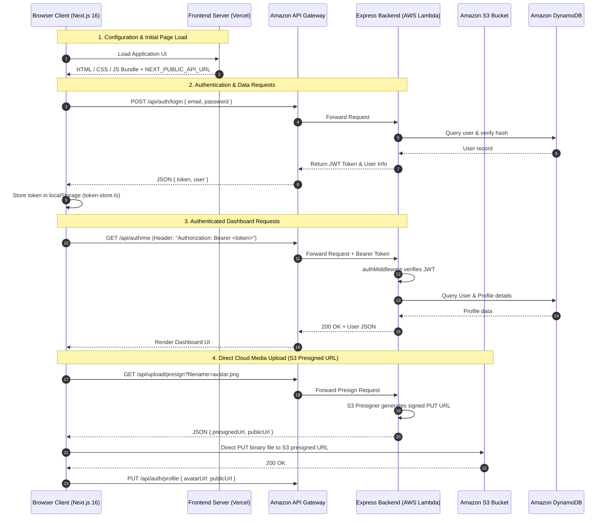

# Document 3: Frontend-Backend Connection, Hosting & Cloud Services Architecture

**Application Name:** Fullstack Auth & Developer Portfolio Platform  
**Target Environment:** Local Development & Production Cloud (Vercel + AWS Serverless)  
**Document Scope:** Detailed breakdown of how the frontend and backend communicate, where the backend runs, and all backend services, databases, cloud resources, and external APIs used.

---

## 1. System Topology & Hosting Overview

```
┌────────────────────────────────────────────────────────────────────────────────────────┐
│                                  SYSTEM TOPOLOGY                                       │
├────────────────────────────────┬───────────────────────────────────────────────────────┤
│ Environment                    │ Frontend (auth-frontend)    │ Backend (auth-backend)   │
├────────────────────────────────┼─────────────────────────────┼─────────────────────────┤
│ Local Development              │ Next.js Dev Server          │ Node.js / Express       │
│                                │ http://localhost:3000       │ http://localhost:5000   │
├────────────────────────────────┼─────────────────────────────┼─────────────────────────┤
│ Production Deployment          │ Vercel Edge Network         │ AWS Serverless Stack    │
│                                │ fullstack-auth-platform-... │ Amazon API Gateway +    │
│                                │ .vercel.app                 │ AWS Lambda (ap-south-1) │
└────────────────────────────────┴─────────────────────────────┴─────────────────────────┘
```

---

## 2. Where the Backend is Running

The backend is architected with dual-runtime capability: it can run locally as a persistent Node.js HTTP server or in production as a completely serverless event-driven microservice on Amazon Web Services (AWS).

### 2.1 Local Development Runtime
* **Entry Point:** `auth-backend/server.js`
* **Process:** Standard Node.js process initialized via `npm start` (`node server.js`).
* **Port & Address:** Listens on `PORT=5000` (`http://localhost:5000`).
* **API Route Prefix:** `http://localhost:5000/api`

### 2.2 Production Cloud Runtime (AWS Serverless)
* **Hosting Provider:** Amazon Web Services (AWS)
* **Deployment Region:** `ap-south-1` (AWS Asia Pacific - Mumbai)
* **Framework:** AWS Serverless Application Model (AWS SAM) & CloudFormation (`template.yaml`).
* **Compute Engine:** **AWS Lambda** (`AuthApiFunction`) running on `nodejs20.x` (x86_64 architecture) with a 30-second execution timeout.
* **Serverless Adapter:** Uses `serverless-http` (`auth-backend/lambda.js`) to wrap the Express.js application into an AWS Lambda handler (`module.exports.handler = serverless(app)`).
* **API Ingress / Gateway:** **Amazon API Gateway HTTP API** (`ServerlessRestApi`).
  - Uses greedy proxy routing (`/{proxy+}`) and root path routing (`/`) to forward all incoming HTTP methods (`GET`, `POST`, `PUT`, `DELETE`, `PATCH`, `OPTIONS`) directly to the Lambda function.
  - Generates the production URL format:
    ```
    https://${ServerlessRestApi}.execute-api.ap-south-1.amazonaws.com/Prod/api
    ```

---

## 3. How Frontend and Backend are Connected



### 3.1 Environment Variable Configuration
The frontend and backend handshake is driven by environment variables:

| Variable | Location | Value / Purpose |
|---|---|---|
| `NEXT_PUBLIC_API_URL` | `auth-frontend/.env` | Points to the backend base API (`http://localhost:5000/api` locally, or AWS API Gateway endpoint in production). |
| `FRONTEND_URL` | `auth-backend/.env` | Specifies the frontend origin for CORS policies and OAuth redirects (`http://localhost:3000` or `https://fullstack-auth-platform-topaz.vercel.app`). |
| `BACKEND_URL` | `auth-backend/.env` | Defines the public backend URL for OAuth callback redirects. |
| `JWT_SECRET` | `auth-backend/.env` | Shared cryptographic key for signing and verifying JSON Web Tokens. |

### 3.2 Cross-Origin Resource Sharing (CORS) Policy
In `auth-backend/app.js`, CORS is tightly controlled with credentials support enabled:
```javascript
const allowedOrigins = [
  process.env.FRONTEND_URL || 'http://localhost:3000',
  'http://192.168.29.139:3000',
  'http://127.0.0.1:3000',
  'https://fullstack-auth-platform-topaz.vercel.app',
];

app.use(cors({
  origin: function(origin, callback) {
    if (!origin || allowedOrigins.includes(origin)) {
      callback(null, true);
    } else {
      callback(new Error('Not allowed by CORS'));
    }
  },
  credentials: true
}));
```

### 3.3 Token Transmission & Storage (`token-store.ts`)
* **Storage:** Auth tokens are stored on the client in `localStorage` under keys `access_token` and `token`.
* **Transport:** Every authenticated fetch request in `auth-backend-client.ts`, `blog-client.ts`, and `project-client.ts` attaches the token via the HTTP standard authorization header:
  ```http
  Authorization: Bearer <jwt_access_token>
  ```
* **Validation:** On the backend, `auth-backend/middleware/authMiddleware.js` extracts the bearer token, verifies its signature using `jsonwebtoken.verify()`, and injects `req.user = { userId, email }` into the request lifecycle.

### 3.4 OAuth 2.0 State & Callback Handshake
For third-party social logins (Google & GitHub):
1. User clicks **"Continue with Google"** on the frontend.
2. Frontend redirects the browser to `GET /api/auth/google`.
3. Backend redirects to Google’s OAuth consent screen.
4. Google redirects back to backend callback `GET /api/auth/google/callback`.
5. Backend verifies the OAuth token, writes a session record to DynamoDB, generates an application JWT, and redirects the browser back to the frontend:
   ```http
   Location: ${FRONTEND_URL}/dashboard?token=${jwt_token}
   ```
6. The Next.js dashboard detects `?token=...`, saves it into `token-store.ts`, clears the query parameter from the browser URL history, and loads user state.

### 3.5 S3 Presigned URL Direct Upload Pattern
To handle file uploads (avatars, blog banners, project screenshots) without bogging down the Lambda execution memory or timeout:
1. Frontend makes a GET request to `/api/upload/presign?filename=avatar.png&contentType=image/png`.
2. Backend generates a presigned Amazon S3 PUT URL valid for 3600 seconds using `@aws-sdk/s3-request-presigner`.
3. Frontend uploads the raw binary file directly to Amazon S3 via `fetch(presignedUrl, { method: 'PUT', body: file })`.
4. Frontend saves the returned `publicUrl` in the user profile or project record.

---

## 4. Complete Catalog of Services Used in the Backend

The backend integrates the following cloud services, modules, and external APIs:

```
┌────────────────────────────────────────────────────────────────────────────────────────┐
│                               BACKEND SERVICES CATALOG                                 │
├──────────────────────┬─────────────────────────────────┬───────────────────────────────┤
│ Category             │ Service / Package               │ Purpose & Role in Backend     │
├──────────────────────┼─────────────────────────────────┼───────────────────────────────┤
│ Serverless Compute   │ AWS Lambda                      │ Executes API business logic   │
│ API Gateway          │ Amazon API Gateway (HTTP API)   │ Ingress routing & CORS proxy  │
│ Primary Database     │ Amazon DynamoDB (NoSQL)         │ Fast, serverless data storage │
│ Object Storage       │ Amazon S3 Bucket                │ Images, media & attachments   │
│ Identity & Auth      │ Passport.js + JWT + Speakeasy   │ Authentication, OAuth, 2FA    │
│ Session Storage      │ connect-dynamodb                │ Express server-side sessions  │
│ Email Engine         │ Nodemailer + Handlebars         │ Transactional email templates │
│ Geolocation Service  │ ipinfo.io & freeipapi.com       │ IP-to-City/Country lookup     │
│ Rate Limiting        │ Custom Sliding-Window Memory    │ Brute force attack defense    │
└──────────────────────┴─────────────────────────────────┴───────────────────────────────┘
```

### 4.1 Compute & Web Framework
* **Node.js 20.x LTS:** Underlying execution runtime.
* **Express.js (v5.2.1):** Web server framework managing routers, controllers, middleware, and request/response pipelines.
* **serverless-http (v4.0.0):** Bridge connecting standard Express request/response objects to AWS API Gateway and Lambda event payloads.

### 4.2 Database Layer: Amazon DynamoDB
The backend uses **7 dedicated DynamoDB tables** with on-demand (pay-per-request) billing and custom Global Secondary Indexes (GSIs):
1. **`auth-users` Table:**
   - **Primary Key:** `id` (String UUID)
   - **Indexes:**
     - `EmailIndex` (`email` HASH)
     - `UsernameIndex` (`username` HASH)
     - `GoogleIdIndex` (`googleId` HASH)
     - `GithubIdIndex` (`githubId` HASH)
   - **Stored Attributes:** name, email, passwordHash, username, avatarUrl, bio, location, website, socialLinks, customLinks, theme, isVerified, mfaEnabled, mfaSecret, verificationToken, verificationCodeExpiry, resetPasswordToken, resetPasswordExpiry.
2. **`auth-user-sessions` Table:**
   - **Primary Key:** `id`
   - **Indexes:** `UserIdIndex` (`userId` HASH), `TokenIndex` (`token` HASH)
   - **Stored Attributes:** userId, token, device (User-Agent), ipAddress, createdAt, lastActive.
3. **`auth-audit-logs` Table:**
   - **Primary Key:** `userId` (HASH), `timestamp` (RANGE - sorted newest first)
   - **Stored Attributes:** action, ipAddress, location, severity (`info`/`warn`/`critical`).
4. **`auth-analytics` Table:**
   - **Primary Key:** `userId` (HASH), `timestamp` (RANGE)
   - **Stored Attributes:** eventType (`view`/`click`), url, title, ipAddress, location, device.
5. **`auth-blogs` Table:**
   - **Primary Key:** `id`
   - **Indexes:** `SlugIndex` (`slug` HASH), `AuthorIdIndex` (`authorId` HASH, `createdAt` RANGE)
   - **Stored Attributes:** title, slug, excerpt, content (Markdown), category, tags, status (`draft`/`published`), featuredImage, publishedAt.
6. **`auth-projects` Table:**
   - **Primary Key:** `id`
   - **Indexes:** `SlugIndex` (`slug` HASH), `AuthorIdIndex` (`authorId` HASH, `createdAt` RANGE)
   - **Stored Attributes:** title, slug, excerpt, content, richSections, featuredImage, logo, gallery, videoDemo, technologies, features, progress, metrics (views, stars, likes, forks), SEO fields.
7. **`express-sessions` Table:**
   - Managed by `connect-dynamodb` for session cookies when session-based flows are exercised.

### 4.3 Object Storage: Amazon S3 (`UploadsBucket`)
* **Service:** Amazon Simple Storage Service (S3)
* **SDK:** `@aws-sdk/client-s3` and `@aws-sdk/s3-request-presigner`
* **Features:**
  - Presigned URL generation (`PutObjectCommand`) enabling secure, direct uploads.
  - Bucket CORS configuration allowing `PUT`, `GET`, and `HEAD` from web origins.
  - Public bucket read policy (`s3:GetObject`) for serving uploaded avatars and showcase screenshots globally.

### 4.4 Authentication, Encryption & Security Services
* **bcrypt (v6.0.0):** Salted cryptographic hashing of user passwords.
* **jsonwebtoken (v9.0.3):** Stateless token generator for sessions and temporary MFA challenges.
* **Passport.js:**
  - `passport-google-oauth20`: Handles Google OAuth 2.0 protocol and profile data extraction.
  - `passport-github2`: Handles GitHub OAuth 2.0 protocol and verified email extraction.
* **speakeasy (v2.0.0):** Cryptographic TOTP secret generator and 30-second token verification.
* **qrcode (v1.5.4):** Encodes `otpauth://` URIs into DataURL QR codes for authenticator app scanning.
* **Rate Limiting Middleware:** In-memory sliding-window IP rate limiter preventing automated brute-force attempts on `/signup`, `/login`, `/forgot-password`, and verification endpoints.

### 4.5 Email Notification Services
* **nodemailer (v9.0.3):** SMTP transport client connecting to AWS SES, Gmail SMTP, or any standard mail server.
* **nodemailer-express-handlebars (v6.1.2):** Server-side email template compiler.
* **Handlebars Templates (`auth-backend/templates/`):**
  - `verification.hbs`: 6-digit registration PIN with expiration countdown.
  - `welcome.hbs`: Welcome onboarding email.
  - `reset-password.hbs`: Password recovery code.
  - `security-alert.hbs`: Real-time suspicious/new login notification with location and IP info.

### 4.6 External IP Geolocation APIs
* **ipinfo.io & freeipapi.com:**
  - Invoked during user login and profile analytics tracking.
  - Converts public client IP addresses into human-readable strings (e.g. *"Bengaluru, Karnataka, India"*).
  - Handles localhost / development fallback through `api.ipify.org` public IP lookup.
